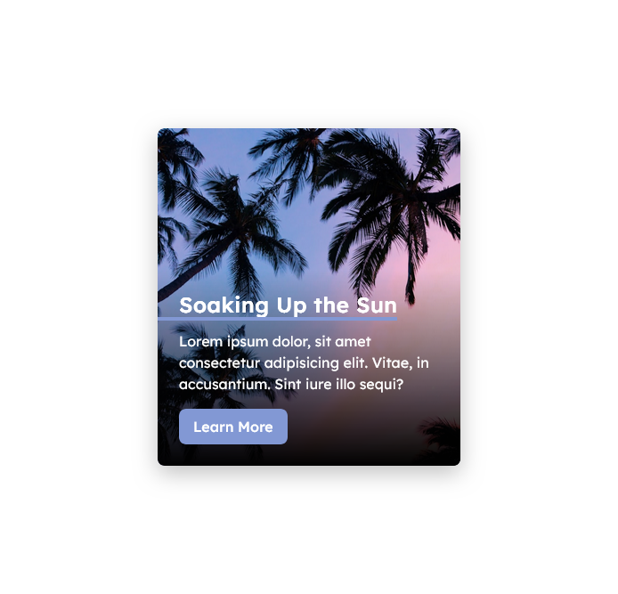

# Simple Animated Card

## Table of contents
  - [Screenshot](#screenshot)
  - [Demo](#Demo)
- [My process](#my-process)
  - [Built with](#built-with)
- [Author](#author)
- [Acknowledgments](#acknowledgments)

## Screenshot

## My process

### Built with

### Demo 
- [Github Pages]()

### Useful Resources
- [Google webfonts helper](https://gwfh.mranftl.com/fonts) - Free way to self-host Google Fonts
- [Favicon generator](https://favicon.io/favicon-generator/) - Make your own favicon icon
- [Unplash](https://unsplash.com/) - Stock photos to use in your website

### Author

## Acknowledgements
[CSS Card with hover animation and mobile fallback](https://www.youtube.com/watch?v=5DEq5cWNYt8) -  YouTube video by Kevin Powell
